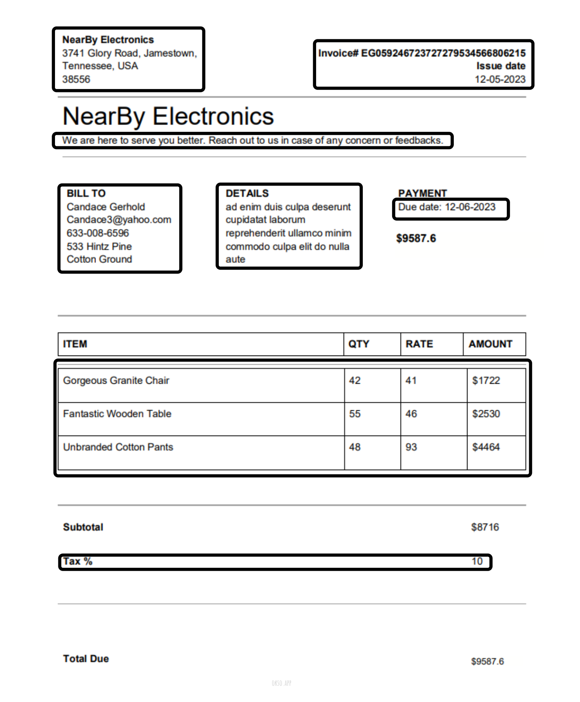

# AdobePDFExtract-Invoices

This repository contains a submission to the Adobe PapyrusNebulae 2023 Document Cloud Hackathon: Round 1.

## Problem Statement

The problem is extracting information from PDF invoices using the Adobe PDF Services Extract API. You can find more information about the API [here](https://developer.adobe.com/document-services/apis/pdf-extract/).

The provided [InvoicesData](https://drive.google.com/drive/folders/1WHnGtmzHbEI_cy44k9bRi2sfUr1ucrya?usp=sharing) includes two folders:

- **SampleInvoicesAndData**: This folder contains two sample invoices and the ExtractedData.csv file, which represents the expected format for extracting data from the invoices.
- **TestDataSet**: This folder contains 100 sample invoices, and participants are expected to extract data from these invoices in the same format as the ExtractedData.csv file.

## Final Output

The final extracted invoices are saved in the [Extracted Invoices.csv](./output/Extractedinvoices.csv) file.

## Invoices Data



## Details Extracted

Example extracted details from the invoices:

1. Bussiness\_\_City: Jamestown
2. Bussiness\_\_Country: Tennessee, USA
3. Bussiness\_\_Description: We are here to serve you better. Reach out to us in case of any concerns or feedback.
4. Bussiness\_\_Name: NearBy Electronics
5. Bussiness\_\_StreetAddress: 3741 Glory Road
6. Bussiness\_\_Zipcode: 38556
7. Customer\_\_Address\_\_line1: 533 Hintz Pine
8. Customer\_\_Address\_\_line2: CottonGround
9. Customer\_\_Email: Candace3@yahoo.com
10. Customer\_\_Name: Candace Gerhold
11. Customer\_\_PhoneNumber: 633-008-6596
12. Invoice\_\_BillDetails\_\_Name: Gorgeous Granite Chair
13. Invoice\_\_BillDetails\_\_Quantity: 42
14. Invoice\_\_BillDetails\_\_Rate: 41
15. Invoice\_\_Description: ad enim duis culpa deserunt cupidatat laborum reprehenderit ullamco minim commodo culpa elit do nulla aute
16. Invoice\_\_DueDate: 12-06-2003
17. Invoice\_\_IssueDate: 12-05-2023
18. Invoice\_\_Number: EG059246723727279534566806215
19. Invoice\_\_Tax: 10

## Folder Structure

The folder structure of this repository is as follows:

```bash
.
├── .gitattributes
├── .gitignore
├── README.md
├── extractedData
│   ├── output00.json
│   ├── output01.json
│   ├── ....
│   ├── output98.json
│   └── output99.json
├── invoice.png
├── invoices
│   ├── input00.pdf
│   ├── input01.pdf
│   ├── ....
│   ├── input98.pdf
│   └── input99.pdf
├── output
│   └── Extractedinvoices.csv
├── package-lock.json
├── package.json
├── pdfservices-api-credentials.json
├── private.key
├── shellOutput.txt
├── src
│   ├── class.js
│   ├── extractor.js
│   ├── index.js
│   └── parser.js
└── test
    ├── extractedData
    │   ├── output0.json
    │   ├── output1.json
    │   ├── output2.json
    │   ├── ....
    ├── index.js
    ├── invoices
    │   ├── input0.pdf
    │   ├── input1.pdf
    │   ├── input2.pdf
    │   ├── ....
    └── output
        └── Extractedinvoices.csv
```

## Code

- `src/index.js` - main script to run the process
- `src/extractor.js` - Javascript file to request the API for JSON data for given PDF file, and save it in `output$.json`
- `src/parser.js` - Script to parse the required data from JSON file and return an array of object about each item in the data
- `src/class.js` - Class declaration and methods for an item

## Packages Used

- `@adobe/pdfservices-node-sdk` - Adobe's NodeJS SDK package
- `adm-zip` - Package to read data in zip file

## Logs

The output while running the script is saved into file [Shell Outputs](shellOutput.txt).
